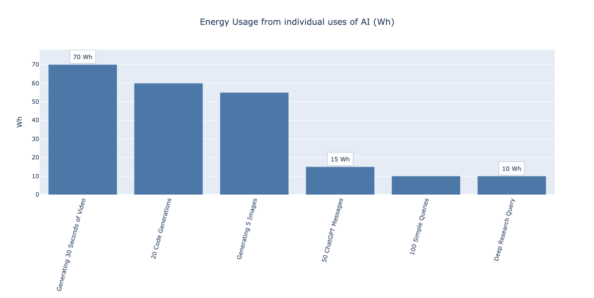
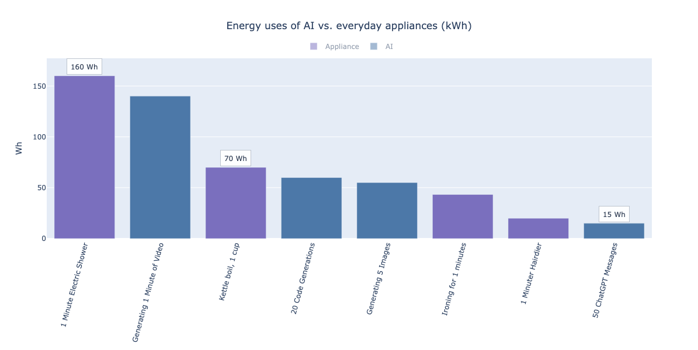
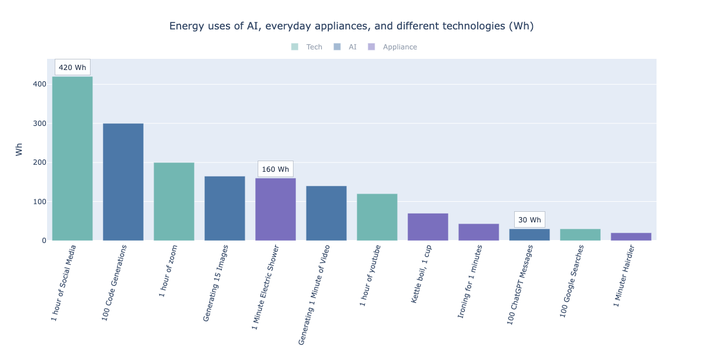
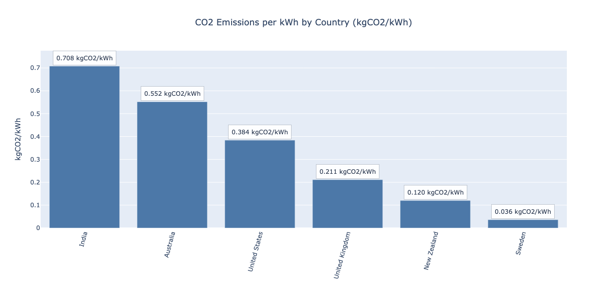
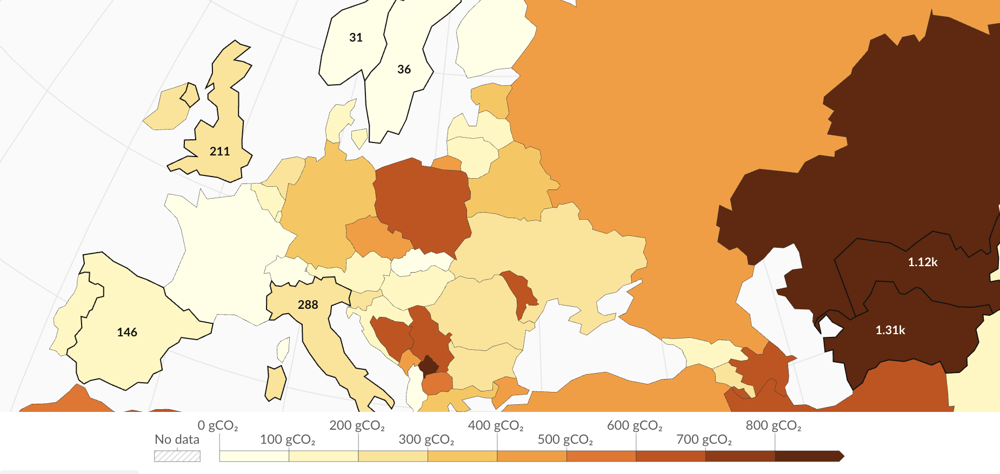
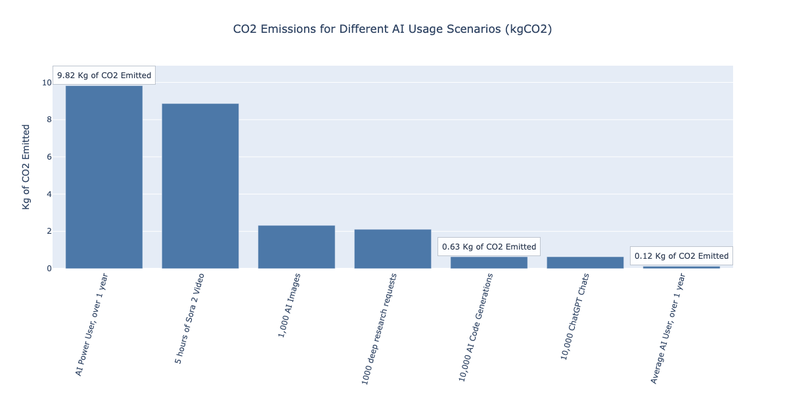
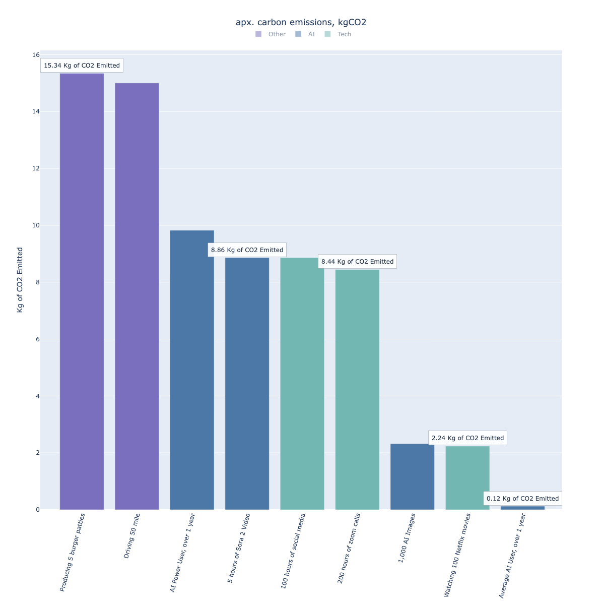
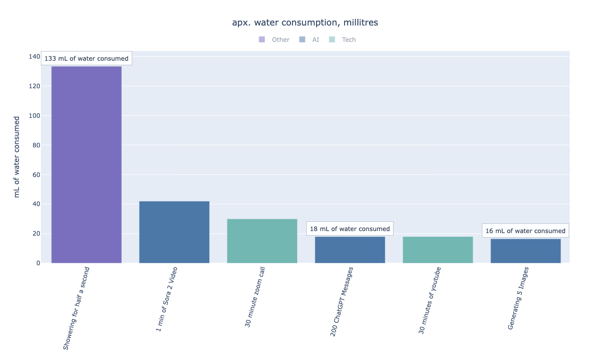
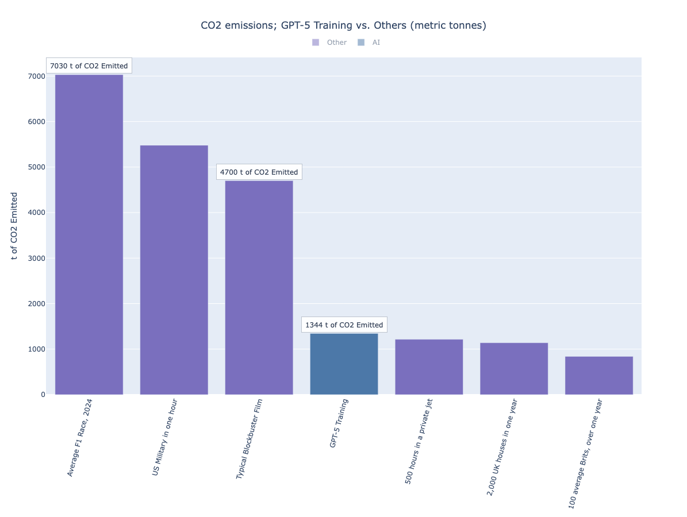
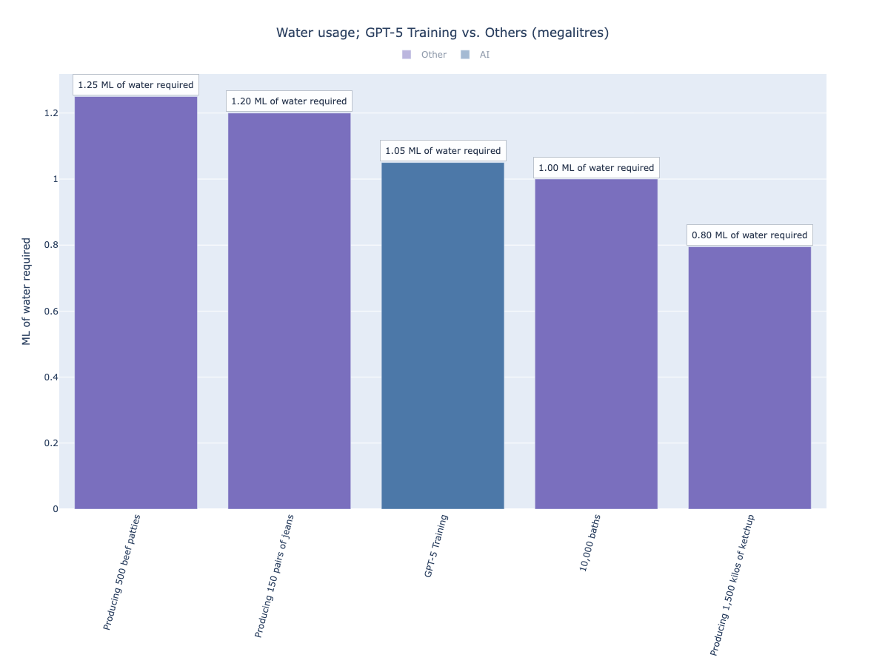

# 🌍 AI & its impact on the environment - A Data Driven View

Hey there - I work at SkyScanner, we get some generous Personal Development Time (PDT) and we can blog about anything we like! I decided to write about AI and its impact on the environment 🙀

> [!IMPORTANT] Beware
> **This is a blog, not a research paper.** I've taken ball-park estimates, applied simple calculations, and plotted these onto graphs. I have my sources below. Please do not take any of the numbers or comparisons as scientifically accurate or precise. The goal is to provide directional insight only.

I have heard many claims about **AI's devastating impact on the environment**; as a keen advocate of AI and **as someone who’s passionate about living on a healthy, green planet** - this has proposed a conundrum to me. So, I decided to investigate further… 🌍🤔

<a id="research-numbers"></a>

## 💡 A bit of research; grabbing some numbers

In short - the reasoning behind AI's perceived negative impact on the environment comes from the **massive data centre uses**; the electricity to power them and water to cool them down.

However - **this situation of course applies to countless technologies** - just think about the processing required behind getting TikTok, YouTube, Netflix, Spotify and Zoom to run in our everyday use...

Taking a look at the data, I’ve pulled in estimations for:

1. Typical energy usage for various AI queries plus other technologies<sup>[1]</sup>, and every day activities.
2. The same for training AI
3. The carbon emissions per unit of energy, by different regions
4. Water Usage Effectiveness of Microsoft Data Centres<sup>[2]</sup>

> [!NOTE]
> <sup>[1]</sup>These numbers carry a significant margin of error; data-centre energy totals are used to work backwards; spreading that power across networks, devices, users, and time to land on a rough cost per operation per user. They represent ball-park figures only; **these numbers are directional, not precise.** The goal is scale, not accuracy.
> <sup>[2]</sup>OpenAI is powered by Microsoft Azure Data Centres; WUE can be measured in Litres per kilowatt hour to detect the water required in datacenter operation.

To see the exact values and their sources, please expand the content below.

<details>
<summary>Estimations used for this investigation</summary>

```python
# AI usage, all measured in kWh
chatGPT_chat=0.0003 # source: https://epoch.ai/gradient-updates/how-much-energy-does-chatgpt-use
image_generation=0.011 # source: https://www.slashgear.com/1696332/ai-image-generation-how-much-energy-used/
min_of_sora_2_video=0.140 # source: https://www.reddit.com/r/theydidthemath/comments/1dnpw9q/comment/la5zw2c/
small_text_query=0.0001
deep_research_chatGPT_query=0.01
reasoning_chatGPT_request=0.02
codex_code_completion=0.003
# source: https://www.abcmoney.co.uk/2025/06/gpt-5-development-sparks-fresh-debate-over-ais-carbon-footprint/
GPT_5_training_energy = 3500 * (10**3)
# source: https://energyguide.org.uk/how-much-electricity-do-appliances-use/
ten_minute_shower=1.6
iron_thirty_minutes=1.3
fridge_day=1.2
hair_drier_ten_minutes=0.2
electric_hob_twenty_minutes=0.6
# source: https://www.autohit.co.uk/electric-car-efficiency-uk-2025-real-driving-costs-per-mile/
driving_electric_car_five_minutes=0.625
# source: https://www.bbc.co.uk/food/articles/energy_saving_tips
boiling_kettle_for_one_tea = 0.07
oven_for_thirty_minutes=1.51
# source: https://www.comparitech.com/tv-streaming/internet-energy-saving-study/
netflix_one_hour = 0.053
streaming_music_one_hour = 0.013
# source: https://www.forbes.com/sites/johnkoetsier/2025/12/03/new-data-ai-is-almost-green-compared-to-netflix-zoom-youtube/
youtube_one_hour = 0.12
# source: https://store.chipkin.com/articles/did-you-know-it-takes-00003-kwh-per-google-search-and-more
google_search = 0.0003
zoom_call_one_hour = 0.2
scrolling_social_media_one_hour=0.42
youtube_one_hour=0.12
# source: https://adam.holter.com/why-your-chatgpt-prompt-uses-half-the-energy-of-a-tiktok-video/
tiktok_per_minute=0.6/1000
# kg of CO2 produced per kwh, source: https://ourworldindata.org/grapher/carbon-intensity-electricity?mapSelect=USA~GBR~SWE
energy_emission_coefficients = {
    "United States": 0.384,
    "United Kingdom": 0.211,
    "Sweden": 0.036,
    "India": 0.708,
    "Australia": 0.552,
    "New Zealand": 0.120,
}
# litres of water used per kwh
# source: https://datacenters.microsoft.com/sustainability/efficiency/
US_Data_Center_L_per_KWH = 0.3
# litres produced examples
one_minute_showering = 16 # source: https://www.ariston.com/en-me/the-comfort-way/news/how-much-water-is-consumed-for-a-shower/
# kg of CO2 produced
driving_one_hundred_miles = 30 # source: https://www.carbonfootprint.com/reduce_vehicle.html
flying_edi_to_beijing_return = 3000 # source: https://co2.myclimate.org/en/portfolios?calculation_id=8369846&localized_currency=GBP
eating_10_beef_burgers=30.68 # source: https://foodfootprint.nl/en/foodprintfinder/hamburger/
average_uk_gas_boiler_emissions_one_year = 2200
# much bigger numbers - kg of CO2
GPT_5_training_emissions = GPT_5_training_energy * energy_emission_coefficients["United States"]
thousand_hour_private_jet = 2430*(10**3) # source: https://sustainabletravel.org/our-work/carbon-offsets/calculate-footprint/
typical_blockbuster_film = 4700 * (10**3) # source: https://zipdo.co/sustainability-in-the-motion-picture-industry-statistics/
US_military_in_one_hour = (131500 * (10**3)) / 24 # source: https://www.theguardian.com/environment/2025/may/30/donald-trump-geopolitics-could-deepen-planetary-catastrophe-expert-warns?utm_source=chatgpt.com
building_london_cheesegrater = 92210 * (10**3) # source: https://finance-commerce.com/2019/06/the-carbon-footprint-of-modern-construction-is-huge/?utm_source=chatgpt.com
average_f1_race_2024 = (168720 * (10**3)) / 24 # source: https://www.formula1.com/en/latest/article/formula-1-on-track-to-be-net-zero-by-2030-with-26-reduction-in-carbon.4p2vZMDrgDu6lVHLvOcLPy?utm_source=chatgpt.com
hundred_brits_average_emissions = 8.4*100*(10**3) # source: https://footprint.wwf.org.uk/
average_UK_home_per_year = 2700*energy_emission_coefficients["United Kingdom"] # source: https://www.ovoenergy.com/guides/energy-guides/how-much-electricity-does-a-home-use
# water usage, in litres
GPT_5_water_usage = GPT_5_training_energy * US_Data_Center_L_per_KWH
# source: https://news.trust.org/item/20120724100000-mf6n8?utm_source=chatgpt.com
pair_of_jeans=8000
one_kilo_of_ketchup=530
one_burger_patty=2500
olympic_pool=2.5*(10**6)
bath=100
# source: https://watercalculator.org/water-footprint-of-food-guide/
one_hundred_grams_chocolate=1800
```

</details>

## 🔌 Energy usage of AI

First of all, let's look how much energy (measured in kWh) is typically used by different AI requests and how this compares in terms we know and understand.

### How requests compare



Clearly there is **significant variation in energy usage depending on how we use AI**. Complexity drives energy usage massively.

The energy usage of 100 simple queries would roughly match a deep research question; and 7 of those roughly matches the energy required for 30 seconds of Sora 2 AI Video.

It's good to see how different requests compare to themselves in AI - but what does this mean in terms we'd understand?

> [!TIP]
> An example simple query could be *"What's the Capital of France"* and a deep reasoning question could be *"Analyse and explain the footfall of a typical Gregg's in London".*

### Comparing to everyday home uses

Firstly, how about looking at comparing these to everyday home appliances



As we can see; **regular daily and some intense uses of AI is very modest compared to everyday household examples**. Even 233 typical ChatGPT messages would roughly be less than the energy required for boiling 1 cup of water.

So; if AI isn't the energy villain in our homes, what about when we compare it to other digital technologies?

### Comparing to other technologies

And finally - let's see how AI compares to other technologies



> [!WARNING]
> Again, this data is not concrete; do not take any comparisons as factual or scientific.

**Typical AI uses seem to be light-weight in the tech world**. The main culprits are with Zoom and Social Media and although AI's energy usage is significant - it is not nothing; generating video especially could be a concern if done many times a day.

It makes sense when you think about it: a single scroll through social media requires on-demand video streaming with heavy, personalised algorithms & think about what must be required to stream that 4K fireplace on YouTube.

## ☁️ But what about carbon emissions?

With AI and tech, **carbon emissions come from the electricity powering the data centres**. The greener the energy, the smaller the footprint — luckily, we actually have metrics to measure this.



**Geography makes a huge difference**.

- The same task in India can produce nearly 20× the emissions of Sweden
- US data centres emit roughly double what the UK does for the same work.



*Extract Our World in Data; carbon intensity, see full [world map view](https://ourworldindata.org/grapher/carbon-intensity-electricity?mapSelect=USA~GBR~SWE) for more.*

### CO2 from individual uses of AI, large scale

So, assuming all processing is done at typical UK data centres - I want to build a view of large scale view of AI use cases over a year and how much CO2 this produces. I use a couple examples as:

#### AI Power User, over 1 year

- 10,000 ChatGPT messages
- 2,000 deep reasoning requests
- 1000 Code generations
- 50 AI images generated

#### Average AI User, over 1 year

- 300 chat queries
- 1,000 ChatGPT messages
- 25 deep reasoning requests

> [!TIP]
> According to ChatGPT 2025 unwrapped; I received 4,784 messages which is in the top 5% worldwide.

Let's see what this all produces:



There's massive difference between being a power user compared to your average user, video generation is significant.

### Compared to more, everyday, use cases

If most users are between the 100g to 10kg of CO2 produced; let's see how these numbers compare in context which we understand.



Here's an interesting graph (or at least it is to me);

- The 120g of CO2 from an average AI user is *almost* insignificant on this graph
- As before; the much higher end of AI uses compare average everyday uses of existing tech
- However, **all these emissions from such technologies over a year can be trumped by a typical 50 mile car journey** (e.g. a return trip from Edinburgh to Falkirk) or just from the process of making 5 burger patties (e.g. someone's big and not-very-tasty dinner).

The major factor here is how green the energy source is; the above is assuming UK electricity - but the picture would be completely different for data centres in Sweden.

## 🌊 What about water usage?

We do hear a lot of the water required in data centre cooling; again this is region dependant and well document by Microsoft in their [data centre efficiency article](https://datacenters.microsoft.com/sustainability/efficiency/).

> [!NOTE]
> In this exercise, we're needing the *Water Usage Effectiveness* measured in Litres required per kWh of electricity. We're assuming the global average of 0.3L/kWh.



Data centre cooling seems efficient at a scale of high-end use; **it would take roughly 400 messages to ChatGPT to waste an espresso-cup sized amount of water** and we have a similar story for other technologies. On a personal scale, the water usage from AI or any technology is not a concern.

## 🐙 A quick note on Claude

Many of us are using coding assistants in our work and seeing great results, these methods seem to be constantly reasoning and producing code, so our metrics like number of chats won’t apply here.

But thankfully in Claude **we can see the token usage**; use `/status` within Claude CLI.

**Heavy usage of Claude would use ~1M tokens over 30 days**, taking estimates we can use a rule of thumb of: **1M tokens roughly consumes 5kWh of energy which emits 1.06kg of CO2** (UK based energy), this very roughly equates to:

- Driving 6km in a typical petrol car
- Running a shower for 30 minutes (electric shower)
- A gaming PC operation for 12hours

> [!WARNING]
> Other estimates in this blog use numbers I've found and [documented above](#research-numbers), however these estimates are from ChatGPT & back-of-the-envelope calculations only... Feel free to challenge them!

## 🤖 Don't forget - training AI

So why all hysteria about AI being bad for the environment? Well an elephant in the room so far ignored is **what is required when training AI,** and this is significant.

> [!TIP]
> The exact details of training a GPT-5-scale model are not public, but it involves running large GPU clusters continuously for weeks to optimise billions of parameters over vast datasets. A significant amount electricity is used and this is largely carried out in the United States.

This is a massive operation. We went from talking about watt hours, millilitres and grams of CO2 to: gigawatts, mega-litres, and thousands of metric tonnes of CO2 emitted.

No need for a graph; **in the tech world, only training AI is capable of this.**

Let's see how the demand compares to other large-scale emitters of CO2; (assuming US-based data centres).



Training large AI models produces substantial emissions; **even more than a typical private jet flying non-stop for 500 hours.**

However, this is a one-off exercise where a trained model is then used by millions globally - the emissions are significantly less than those from producing a movie or from a typical F1 race.

### And its water usage

Again; this will follow the same pattern as above - the extreme amount of computation would require an extreme amount of water for cooling, the likes of which has never been needed for Zoom or Social Media.

Again; let's see how this compares to other gotcha's we may not expect:



The fact that training an GPT model uses more water than 10,000 baths is again - crazy.

Though we have more concerning consumers of our water - roughly 8,000L goes into producing a pair of jeans and 2,500L for the process of producing a single burger patty.

> [!NOTE]
> The AI autocomplete recommends I write that the water usage of AI is negligible... I wouldn't go that far!

## 🌍 Closing thoughts & how we can help

This blog is not a deep-dive; I’ve ball-parked AI’s impact to the environment, compared this to other activities, and have come to the conclusion that *it doesn’t seem all that bad* in context.

If you’re considering cutting back on AI to help the planet; it is my opinion that this would not be effective; there are far bigger and easier gains outwith AI. See what [WWF say about it](https://www.wwf.org.uk/thingsyoucando), and if energy usage is the worry - perhaps consider the impact of streaming video or scrolling social media.

> [!IMPORTANT]
> To be frank, the real discussion shouldn't be about using AI - it should be about how green its energy is. In other words, **AI isn't bad for the environment, powering it with fossils fuels is.** This should be the debate.

So, how can we help? It’s not for me to say here, but it’s always good practise to educate yourselves; be a little skeptical, have some conversations, and do your own research. As a few pointers:

- Chat to Ecosia’s AI: [https://www.ecosia.org/ai-search](https://www.ecosia.org/ai-search) (backed by renewable energy)
- Consider the book: [https://www.goodreads.com/book/show/7230015-how-bad-are-bananas](https://www.goodreads.com/book/show/7230015-how-bad-are-bananas)  (I’ve not read this yet; but considers and discusses carbon footprint of all our everyday activities)

## 🗣️ Most importantly - what do you think?

**This blog is not a conclusive or definitive answer**; I'm intending this as a starting point for discussion and thought, and there are likely points in this where I'm wrong or have made incorrect assumptions.

I like a challenge and I like to learn more, we all should be doing so; I'd love to hear your thoughts! If you know me - chat to me directly; if you saw this post online - comment on that post; if you have anything you'd want to say - please do, my LinkedIn is below.

… Anyway, that's me. I hope this has been a useful and informative read! Adios ☮️
